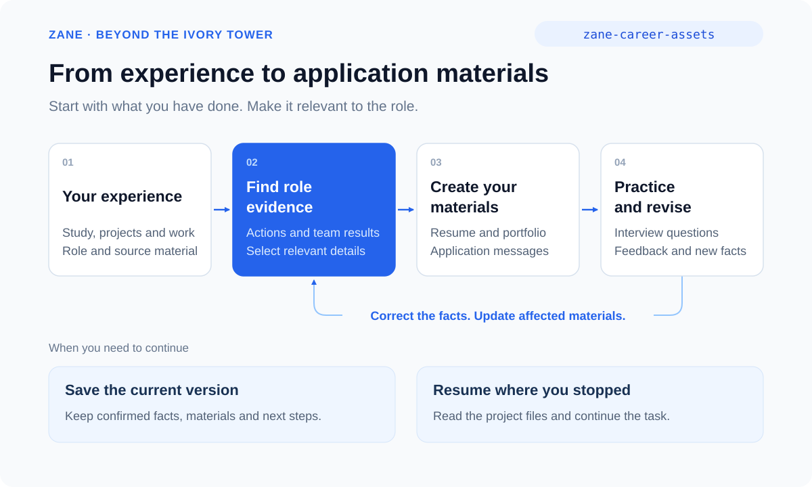

# Beyond the Ivory Tower

[简体中文](README.md) | English

> Turn what you have done into a resume, a portfolio, and clear stories for your job search.

[](VERSION.md)
[](LICENSE)

**An AI job search toolkit for students entering work and recent graduates reconsidering their direction.**

Find evidence of your skills in coursework, student activities, internships, and work. Compare roles, create resumes and portfolios, and prepare for interviews. As your experience grows, use the same methods for job changes and career transitions.

**For Claude Code, Codex, and other tools that support Agent Skills. Free and open source.**

[Quick start](#quick-start) · [What it helps with](#what-it-helps-with) · [Capabilities](#capabilities) · [Install](#install) · [Using the toolkit](#using-the-toolkit)



## What it helps with

Start with a real experience and connect it to the work you want to do.

| What you want to do | What the toolkit helps you produce |
| --- | --- |
| Review coursework, student activities, internships, or a first job | Specific actions, work samples, and evidence of your contribution |
| Compare roles or reconsider your direction after graduation | Role comparisons grounded in your experience, with practical ways to explore |
| Create a resume in Chinese, English, or another language | Content and layout suited to the hiring market, with editable and exportable files |
| Present projects and work samples | A clear division of roles between your resume, website, and case studies |
| Prepare introductions and project interviews | Answers grounded in your experience, with practice one turn at a time |
| Present team projects and employer material | Clear attribution and a considered choice of what to share |
| Update multiple languages and formats | Consistent facts across resumes, websites, cases, and interview stories |

## Quick start

### 1. Install

```bash
npx -y skills add ZanePan2027/zane-career-skills -g --all
```

### 2. Tell your Agent what you are working on

```text
Use zane-career-assets.
I am preparing for my first job. I completed a course project and managed
registration and check-in for a student event. Here are my report and notes.
Help me identify what belongs on my resume, then compare what to emphasize
for these two roles.
```

You can also ask for a specific result:

```text
Use zane-career-assets. I graduated two years ago and am comparing operations
with brand planning. Here is my work history and two job descriptions.

Use zane-career-resume-builder to create an English resume for a product internship.

Use zane-career-assets to practice a project interview, one turn at a time,
based on this resume and job description.

Use zane-career-portfolio-website-design to build a portfolio from these projects.
```

## How it works

The toolkit organizes facts and evidence from your experience, then uses the target role to decide what to emphasize and how to present it. Your resume, portfolio, application message, and interview answers draw on the same material. A corrected fact carries through to the affected work.

For example, a student event can provide evidence of coordination and execution. The toolkit distinguishes your actions from the team's work and the event's scale, writes a clear resume entry, and helps you explain the process in an interview.

## Capabilities

| Goal | Main Skill | Typical output |
| --- | --- | --- |
| Review experience, compare roles, prepare for interviews | `zane-career-assets` | Evidence, role comparisons, answer drafts, and practice |
| Build a complete set of application materials | `zane-career-portfolio-builder` | Resume, portfolio, cases, and application entry points |
| Create or localize a resume | `zane-career-resume-builder` | Content, layout, editable source, and PDF |
| Plan how recruiters read a portfolio | `zane-career-portfolio-architecture` | Homepage, detailed cases, and work index |
| Build a portfolio website | `zane-career-portfolio-website-design` | Visual design, responsive pages, and source files |
| Write project stories | `zane-career-case-editor-zh`, `zane-evidence-weighted-case-storytelling` | Decisions, actions, results, and individual contributions |
| Prepare employer material for sharing | `zane-former-employer-data-redactor` | Material to publish, redact, or discuss in an interview |
| Write the first application message | `zane-career-application-greeting` | A short message suited to the role and language |
| Check deliverable files | `zane-portfolio-multi-format-qa` | Web, PDF, Word, QR code, and link checks |
| Work from visual references | `zane-design-reference-to-prompt` | Design direction and implementation requirements |

Start with `zane-career-assets`, or call a specific Skill for a focused task. See the [Skill inventory](docs/skill-inventory.md) for details in Chinese.

## Install

### Recommended: install the complete collection

```bash
npx -y skills add ZanePan2027/zane-career-skills -g --all
```

Or ask your Agent:

```text
Install all Skills from https://github.com/ZanePan2027/zane-career-skills.
Then use zane-career-assets to help me with this: ...
```

Reload Skills if your tool requires it. To install for the current project, omit `-g`. For an update, ask the Agent to compare the installed copy with the repository and preserve your local edits before replacing it.

## Using the toolkit

Share your current job search goal and the material you have: an experience, an old resume, a course report, a work sample, or a job description. The toolkit starts with the task at hand.

- **When reviewing experience**, explain what you did and share material that helps reconstruct the work.
- **When creating application materials**, specify the role, hiring market, language, and desired files.
- **When preparing for interviews**, use the relevant resume and job description for drafting or live practice.
- **When you receive feedback**, bring back recruiters' questions, revision requests, or factual corrections to update the affected work.

Keep the results in a project location you choose. Ask the Agent to save the current material and stopping point when you want to continue later.

## Provenance and license

These methods grew from practical work on resumes, bilingual portfolios, project stories, and job applications, with continued attention to role relevance, consistency, and real feedback.

See [Provenance](docs/provenance.md) for design references. This repository uses the [MIT License](LICENSE).

Author: Zane
