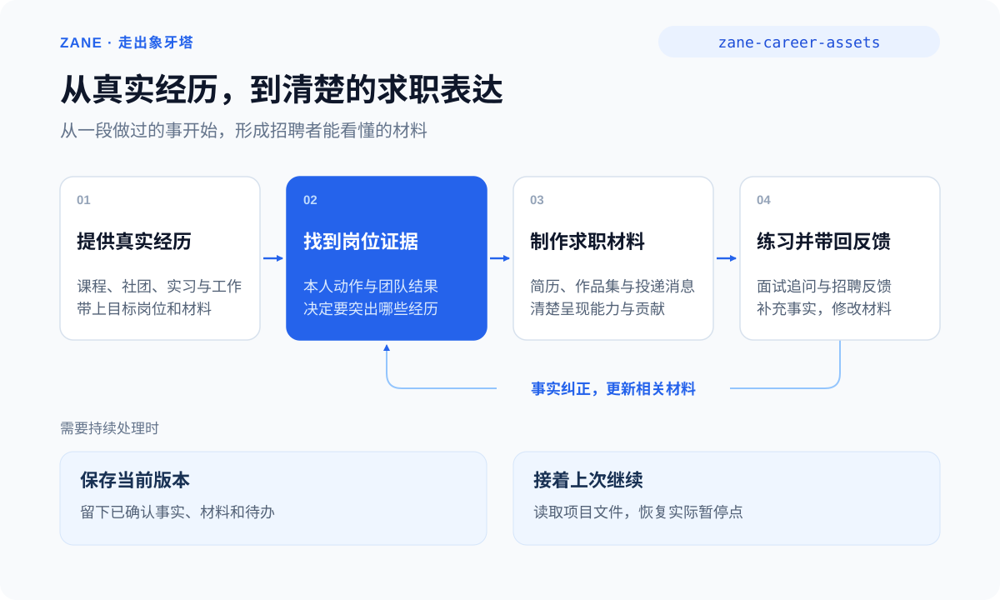

# 走出象牙塔

简体中文 | [English](README.en.md)

> 从不知道投什么，到写好材料、聊到面试、判断 offer。解决你眼前的求职问题。

[](VERSION.md)
[](LICENSE)

**面向入职前各环节的 AI 求职工具箱，重点服务实习生、应届毕业生和工作 1—2 年的新人。** 有多年经验、正在换工作的人也可以用，按实际资历处理。

**适用于 Claude Code、Codex，以及其他支持 Agent Skills 的工具。免费开源，可独立安装使用。**

[快速开始](#快速开始) · [可以处理的事](#可以处理的事) · [使用教程](docs/guide.md) · [能力目录](docs/skill-inventory.md) · [安装与更新](docs/install.md)



把旧简历、岗位截图、项目材料、面试问题或 offer 给 Agent，直接说需要什么。不用先建工作台，不用按固定顺序走完所有步骤。

<a id="安装"></a>

## 快速开始

### 1. 安装

在终端执行：

```bash
npx -y skills add ZanePan2027/zane-career-skills -g --all
```

也可以直接告诉 Agent：

```text
请从 https://github.com/ZanePan2027/zane-career-skills 安装全部 Skills，
然后使用 zane-career-assets，帮我处理这件事：……
```

按安装界面选择 Agent，完成后按宿主要求重载。命令安装需要 Node.js 和 `npx`；项目级安装和更新见[安装说明](docs/install.md)。

### 2. 从手头的任务开始

```text
请使用 zane-career-assets。这是我的旧简历和想投的岗位。
我主要用 BOSS 直聘，请帮我重做一份简历，
同时写好在线简历的个人优势开头和这个岗位的打招呼语。
先直接做出可编辑版本，我看完再提修改。
```

已有的信息直接使用，只补问影响结果的缺口。默认完成你要的候选稿或文件，再按反馈修改；想先确认文案再设计，也可以直接说。

## 可以处理的事

| 当前问题 | 可以得到 |
| --- | --- |
| 不知道适合投什么，没有实习怎么写？ | 方向比较、真实经历取材与可尝试的小项目 |
| 到哪里找实习／校招／社招，怎样看 JD？ | 岗位筛选条件、可核查机会、资格与匹配判断 |
| BOSS 直聘开头写什么，打招呼总没回应？ | 在线简历首句、个人优势、岗位招呼语与沟通调整 |
| 旧简历要重做，想做英文版 | 针对岗位和市场的内容、版式及所需文件 |
| 需要作品集，但项目不多 | 可展示作品选择、案例内容、文档或网站 |
| 笔试、作业和面试不知道怎么准备 | 练习方案、回答改进、一问一答的模拟面试 |
| offer 怎么选，怎样谈薪或回复？ | 同口径待遇比较、待核实条款、谈薪与回复草稿 |
| 签约、背调、到岗前要准备什么？ | 针对当前情况的手续梳理、核实问题与时间安排 |

覆盖入职前的求职链路，不代表保证录用或替代具体地区的法律专业意见。岗位、平台功能和政策涉及实时信息时，会核查当前依据；访问不到的内容不会编造成搜索结果。

## 围绕 BOSS 直聘等平台使用

在线简历开头让对方迅速看懂相关性；完整资料和附件简历证明经历；打招呼语连接当前岗位；作品集按需展示作品与过程；后续沟通争取把具体问题聊清楚。

这些触点使用同一套真实经历，但各有用途。没有统一的“前 22 字必胜公式”：有当前界面或你给定的字数要求，就按预算实际计数；没有，就优先把最相关的信息前置。[平台核查依据](skills/zane-career-assets/references/platform-evidence.md)

管理者承担的团队成果可以作为管理业绩，普通协作成员按实际工作表达。不会要求你为每句简历附上归因审计，也不会替你编造实习、数字或职责。

[看使用示例：旧简历、BOSS 沟通、作品集、面试与 offer](docs/guide.md)

## 继续修改与保存

单次任务可以直接完成。需要下次继续时，让 Agent 在现有项目中保存当前版本和暂停点；下次在同一项目说“接着上次”。位置已知不必反复指定文件夹；纯聊天环境可保留简短摘要。

制作与对外动作分别处理：生成消息不等于已发送，生成简历不等于已投递，比较 offer 不等于接受。实际发送、公开发布和接受条件按你相应的授权执行。

## 能力与验证

11 个 Skill 组成独立工具箱。日常只需要 `zane-career-assets`，它按当前任务读取方法并直接完成；熟悉后可直接调用[专项工具](docs/skill-inventory.md)。无需安装人生、商业或职业成长工作台，也不依赖安装 DBS。

[当前验证范围与限制](docs/testing.md)记录实际检查；真实招聘回复率和录用效果仍需使用反馈验证。欢迎通过 Issues 提交去除个人与公司敏感信息的实例。

## 来源与许可证

参考 DBS 的按任务选择方法、按需读取与接续思路，结合求职材料制作中的实际问题重新设计。[设计取舍与来源](docs/provenance.md)。没有复制或改名收录 DBS 的 Skill。

本仓库采用 [MIT License](LICENSE)。作者：Zane
